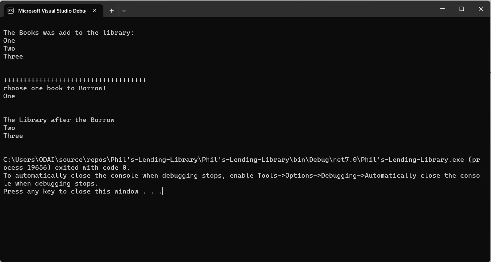
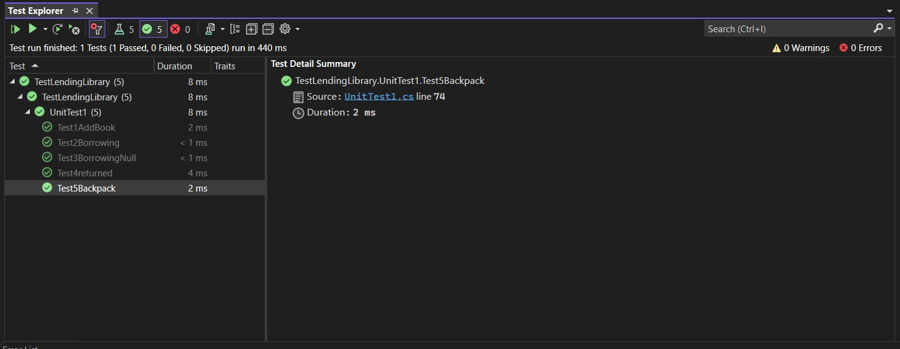

# Lab08-Collections (Phil’s-Lending-Library)

## Descreption

In this console application, I have built a library application. The library is capable of receiving a large number of books for storage. Any book can be borrowed and returned to the library by the user.

## How it work

In this application, all the books that will be displayed to users are provided to the library at once, and they can be added to the library and deleted at any time. In addition, books can be added and deleted at any time. Furthermore, users may choose books from the display inside the library to borrow. In this case, the application temporarily removes the book from the library until it is returned by the user to be displayed again.

## Visual

